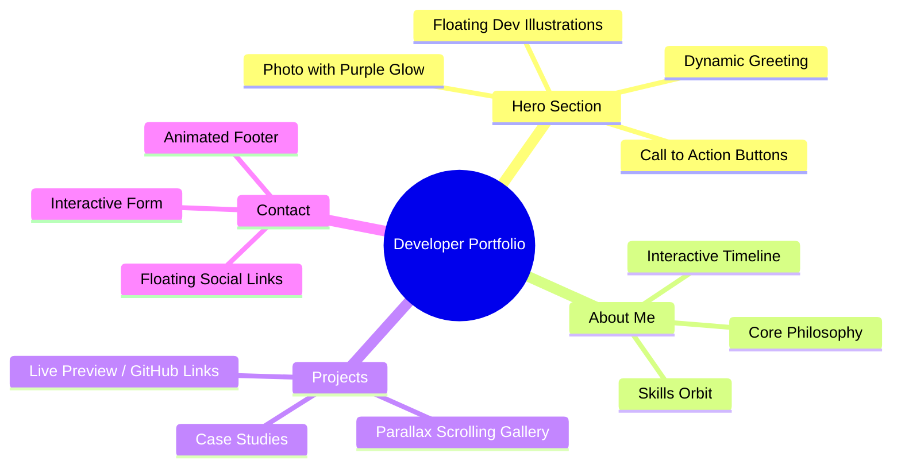

# 🚀 Developer Portfolio Master Plan

## 🧠 Portfolio Mind Map



## 🛠 Tech Stack

| Category | Technology | Purpose |
|---|---|---|
| **Core Framework** | React.js (Vite) | Component-based UI, fast dev experience |
| **Language** | JavaScript (ES6+) | No TypeScript, clean and familiar |
| **Styling** | Tailwind CSS | Utility-first, rapid layout building |
| **Routing** | React Router DOM | Client-side page navigation |
| **Smooth Scrolling** | Lenis.js | Buttery smooth, premium scroll feel |
| **Scroll Animations** | GSAP + ScrollTrigger | Scroll-linked reveals, parallax, sticky |
| **UI Animations** | Framer Motion | Page transitions, hover, stagger effects |
| **Icons** | React Icons | Dev icons, social links |
| **Deployment** | Vercel / Netlify | Free, instant CI/CD deployment |

## 📂 Complete File Structure

```text
my-portfolio/
├── public/
│   ├── images/             # Your photo, project screenshots
│   └── fonts/              # Custom fonts if any
├── src/
│   ├── components/         # All UI components
│   │   ├── Navbar.jsx
│   │   ├── Hero.jsx        # Photo + purple glow + text blur card
│   │   ├── About.jsx
│   │   ├── Projects.jsx
│   │   ├── Contact.jsx
│   │   ├── Footer.jsx
│   │   └── CustomCursor.jsx
│   ├── sections/           # Full page section wrappers
│   ├── data/
│   │   └── portfolio.js    # All content: projects, skills, links
│   ├── hooks/
│   │   └── useLenis.js     # Smooth scroll setup hook
│   ├── App.jsx             # Root component, routes
│   ├── main.jsx            # Entry point
│   └── index.css           # Global Tailwind + custom CSS
├── index.html
├── vite.config.js
├── tailwind.config.js
├── package.json
└── README.md
```

## ✨ Professional Animations & Unique Features

1. **Custom Interactive Cursor** — changes shape on hover over buttons/links
2. **Lenis Smooth Scroll + GSAP ScrollTrigger** — buttery scroll-linked reveals
3. **Magnetic Buttons** — buttons pull slightly toward the cursor on hover
4. **Hero Reveal** — staggered animation on load: photo → glow → text → buttons
5. **Parallax Project Gallery** — images glide at different speed than text
6. **Purple Glow Light Effect** — around your photo in the hero section
7. **Floating Dev Illustrations** — cartoon laptop/monitor floating elements around hero

## 🎨 Color Palette

| Name | Hex | Usage |
|---|---|---|
| Background | `#0d0d1a` | Deep navy-black base |
| Primary Purple | `#7c3aed` | Glow, buttons, accents |
| Golden Yellow | `#fbbf24` | Highlight accents, CTAs |
| White | `#ffffff` | Headings and text |
| Muted Text | `#94a3b8` | Subtitles, descriptions |
